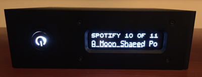
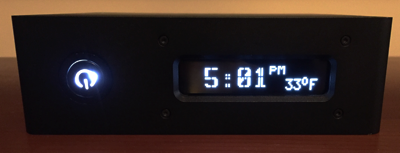

# pydPiper 
A python program written for the Raspberry Pi that controls small LCD and OLED screens for music distributions like Volumio, RuneAudio, and Max2Play.
  


## Features
  * Supports multiple music distributions including Volumio (v1 and v2), RuneAudio, MoodeAudio, and Max2Play.
  * Screens are fully user definable
  * Supports a rich set of system and environmental variables including local weather
  * Compatible with the Winstar WEH and WEG OLED displays
    * Coming soon... HD44780 style LCD support
  * Fully graphics based in its backend allowing any arbritrary font, character set, or image to be displayed if the hardware supports it.
    * Coming soon... For LCD character based displays will dynamically generated custom characters to support characters missing from the font table.  This feature can also be used to display some graphical content on character-based displays though this is limited by the small amount of memory available for customer characters on HD44780 based displays.

## Display configuration

pydPiper displays are configured based upon three key concepts.  The first concept is widget.  Widgets are used to draw a particular type of content on onto the screen.  There are widgets for displaying text, drawing lines and rectangles, displaying images, or showing a progress bar.  The next concept is canvas.  Canvases are collections of widgets where each widget is placed at a particular place within the canvas.  You will typically create a set of canvases that are the same size as your display with each canvas dedicated to a particular display purpose (e.g. show artist, display time).  The last concept is sequences.  A sequence is an ordered list of canvases that are displayed in turn when the sequence is activated.  There should be a sequence for each mode that the music player uses (e.g. play, stop).  Sequences are controlled through conditional expressions which are boolean logic statements.  If the statement evaluates to True, the sequence is activated.  If it is false, the sequence remains dormant.  In addition, each canvas within a sequence can also have a conditional statement to control whether the canvas gets displayed when its turn within the sequence occurs.  Here is a short example.

FONTS = {
	'normal': { 'default':True, 'file':'latin1_5x8_fixed.fnt','size':(5,8) },
}

WIDGETS = {
	'artist': { 'type':'text', 'format':'{0}', 'variables':['artist'], 'font':'normal' },
	'title': { 'type':'text', 'format':'{0}', 'variables':['title'], 'font':'normal' },
  'time': { 'type':'text', 'format:Time\n{0}', 'variables':['utc|timezone+US/Eastern|strftime+%-I:%M'], 'just':'center', 'size':(80,16) }
 }
 
CANVASES = {
	'playingsong': { 'widgets': [ ('artist',0,0), ('title',0,8) ], 'size':(80,16) },
}

SEQUENCES = [
	{
		'name': 'seqPlay',
		'canvases': [ { 'name':'playingsong', 'duration':15 } ],
		'conditional': "db['state']=='play'"
	},
	{
		'name': 'seqStop',
		'canvases': [ { 'name':'time', 'duration':9999 } ],
		'conditional': "db['state']=='stop'"
  }
]

This simple example will display the artist on the top line and the title on the bottom line of the display if the system is playing a song.  If the player is stopped, it will display the current time centered on the display.  Full documentation for configurating the display will be found in docs/display.md once I've written it.  In the mean time, to get you started there are two example configurations provided.  Use pages_fixed.py for LCD and Winstar WEH OLEDs or pages_g.py for Winstar WEG displays.

## Installation Instructions

These instructions provide a general description of what you need to do in order to get pydPiper up and running on your system.  Instructions specific to individual music distributions will eventually be provided in the docs directory.

#### Step 1.  Download pydPiper to your system
Log in to your system and issue the following commands to download the software and place it within the /usr/local/bin directory.  If you prefer to place it somewhere else, modify the location you untar it from accordingly.

```
sudo wgets https://github.com/dhrone/pydPiper/archive/v0.21-alpha.tar.gz
sudo tar zxvf v0.21-alpha.tar.gz --directory /usr/local/bin
cd /usr/local/bin/pydPiper-0.21-alpha
```

#### Step 2.  Install required python packages
pydPiper relies upon several python packages that are not included with most of the music distributions.  These are...
* moment -- Used to support the display of system time
* python-mpd2 -- Used to support reading data from the MPD daemon (used by Volumio v1)
* pyLMS -- Used to support pulling metadata from Logitecth Media Server (used by Max2Play)
* redis -- Used to support pulling metadata from the redis in-memory database (used by RuneAudio)
* pyOWM -- Used to retrieve weather data (optional)

Most of these packages can be installed using pip (or pip2 on RuneAudio).  
```
sudo pip install moment
sudo pip install python-mpd2
sudo pip install pyLMS
sudo pip install redis
sudo pip install pyOWM
```

pydPiper also requires the Python Imaging Libary (PIL).  Your distribution may already have this installed.  If not, you will need to install python-imaging.
```
sudo apt-get install python-imaging
```

Note: It is ok to leave out packages not needed for your particular distribution.

| Package     | Volumio v1 | Volumio v2 | RuneAudio | Max2Play | Moode    |
|-------------|:----------:|:----------:|:---------:|:--------:|:--------:|
| moment      | Yes        | Yes        | Yes       | Yes      | Yes      |
| python-mpd2 | Yes        | No         | No        | No       | No       |
| pyLMS       | No         | No         | No        | Yes      | No       |
| redis       | No         | No         | Yes       | No       | No       |
| pyOWM       | optional   | optional   | optional  | optional | optional |

#### Step 3.  Modify pydPiper's configuration file to localize it to your installation
You can use your preferred editor to edit pydPiper_config.py located in the root of the pydPiper installation.  For me this would be done using vi with the command.
```
sudo vi /usr/local/bin/pydPiper-0.21-alpha/pydPiper_config.py
```
The most important settings to adjust are the DISPLAY_PINS as your display will not operate correctly if any of them are incorrect.  If you are using an Audiophonics Raspdac V3, the provided values should be correct.  Otherwise you will need to set them up to match how you wired your display to your Raspberry Pi.

You may also want to adjust ANIMATION_SMOOTHING if the display is scrolling too slow or too fast for your taste.  I found 0.15 to be a good value but some users have reported a preference for longer values.

#### Step 4.  Run pydPiper
Start pydPiper by running 'python pydPiper.py' followed by the music service you are using. As example...
```
sudo python pydPiper.py --rune
```
Will start pydPiper for the RuneAudio distribution.  Possible values are...

| flag      | music source           |
| --------- | :-------------------:  |
| --rune    | RuneAudio              |
| --lms     | Logitech Media Server  |
| --volumio | Volumio V2             |
| --mpd     | Music Player Daemon *  |
| --spop    | Spotify Music Daemon * |
* Used by Volumio and Moode only.  For those two systems you will want to specify both --mpd and --spop on the command line.

You will also want to specify a pages file to load.  This is done using the --pages.  Example...
```
sudo python pydPiper.py --rune --pages 'pages_fixed.py'
```
If you do not specify a pages file, pydPiper will attempt to load 'pages.py' which is the default.

At this point pydPiper should be up and running.  You can exit from the running program using Ctrl-C.

If you want the pydPiper to start when the Raspberry Pi is booted you can add it to the start-up routine for your specific distribution.  Specific instructions for each distribution will eventually be provided in the docs folder.
 
## History

Version 0.21 (Alpha). Minor bug fixes.
Version 0.2 (Alpha).  Initial testing release.


## Credits

The basis for most of this code comes from Lardconcepts (https://gist.github.com/lardconcepts/4947360)
A great overview of LCD/OLED logic is available on Wikipedia (https://en.wikipedia.org/wiki/Hitachi_HD44780_LCD_controller).  While that document is focused on the popular HD44870 LCDs, most of what is describe there applies to the Winstar OLED.  There are important differences though.  The OLED appears to be much more sensitive to timing issues and requires a different command sequence to reset it back to a known good state upon a warmstart.
Understanding the initialization behavior of the Winstar in 4 bit mode was greatly assisted by PicAxe who currently have a PDF posted which detailed a method to resync with the display.  This is described on the last page of  http://www.picaxe.com/docs/oled.pdf.

## License

The MIT License (MIT)

Copyright (c) [2015] [Dhrone]

Permission is hereby granted, free of charge, to any person obtaining a copy
of this software and associated documentation files (the "Software"), to deal
in the Software without restriction, including without limitation the rights
to use, copy, modify, merge, publish, distribute, sublicense, and/or sell
copies of the Software, and to permit persons to whom the Software is
furnished to do so, subject to the following conditions:

The above copyright notice and this permission notice shall be included in all
copies or substantial portions of the Software.

THE SOFTWARE IS PROVIDED "AS IS", WITHOUT WARRANTY OF ANY KIND, EXPRESS OR
IMPLIED, INCLUDING BUT NOT LIMITED TO THE WARRANTIES OF MERCHANTABILITY,
FITNESS FOR A PARTICULAR PURPOSE AND NONINFRINGEMENT. IN NO EVENT SHALL THE
AUTHORS OR COPYRIGHT HOLDERS BE LIABLE FOR ANY CLAIM, DAMAGES OR OTHER
LIABILITY, WHETHER IN AN ACTION OF CONTRACT, TORT OR OTHERWISE, ARISING FROM,
OUT OF OR IN CONNECTION WITH THE SOFTWARE OR THE USE OR OTHER DEALINGS IN THE
SOFTWARE.
